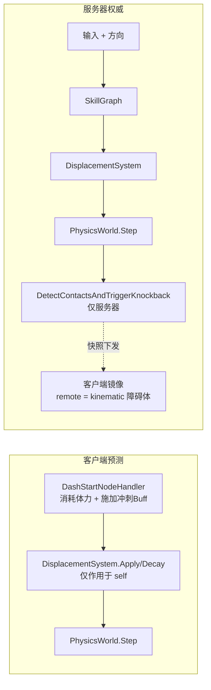

# S8 代码审查 — Dash / 体力 / 撞击击退

- **审查对象**：commit `d5ad566` `feat(battle): implement S8 dash stamina and knockback`
- **审查日期**：2026-08-07
- **规模**：64 文件，+5939 / -665 行；新增 8 个类型
- **配套实现计划**：[S8-Dash与体力与撞击击退-实现计划.md](./S8-Dash与体力与撞击击退-实现计划.md)

---

## 1. 概览

S8 实现了一套**服务器权威的击退 + 本地预测的冲刺/体力**机制。

核心职责划分：

| 子系统 | 归属 | 关键文件 |
| --- | --- | --- |
| 冲刺位移（方向锁定、衰减） | 客户端预测 + 服务器 | `DisplacementSystem.cs` / `PlayerState.cs` |
| 体力消耗与回复 | 双端同构 | `StaminaSystem.cs` / `DashTuning.cs` |
| 击退检测与触发 | **仅服务器** | `BattleLogic.cs` `DetectContactsAndTriggerKnockback` |
| 击退位移施加 | 服务器触发，客户端 restore 后施加 | `DisplacementSystem.Apply` |
| remote 玩家表现 | 纯快照镜像（kinematic 障碍体） | `BattleSimulation.cs` `MirrorRemotePhysicsBodies` |

---

## 2. 架构亮点（做得好的部分）

1. **击退的服务器权威边界清晰**。客户端 `BattleSimulation` 的 tick 循环（`BattleSimulation.cs:939-947`）只对 self 做 `DisplacementSystem.Apply/Decay` + `StaminaSystem.Tick`，**从不调用** `DetectContactsAndTriggerKnockback`。击退只能由服务器检测、经快照下发，客户端 restore 后再在本地施加速度——这正是 `client-prediction-never-self-triggers-knockback` 测试要守的契约。

2. **remote 玩家用 kinematic 障碍体镜像**（`MirrorRemotePhysicsBodies` → `SetBodyKinematicObstacle(true)` + `SetBodyTransform`）。kinematic 体零速度、不参与占位推开的位移分摊、从快照剔除（`FrameSyncPhysicsWorld.cs:170-195`），既能让 remote 挡住 self 移动，又不会被占用解算推动。

3. **体力消耗的幂等性**。冲刺执行有"每个 caster 至多一个 lockstep 执行"的守卫（`RuntimeSkillGraph.cs:753-760`），加上 `DashStartNodeHandler` 内的 `HasBuff` 双重检查，保证一次冲刺只消耗一次体力；rollback 时 `RestoreExecutions` 从 runner 快照续跑而非重跑 DashStart，因此**不会重复扣体力**（`skillgraph-execution-replays-after-rollback` 守这一条）。

4. **位移衰减顺序一致且有文档**。client/server 都是 Apply→Decay→Step；服务器注释明确说明"接触阶段产生的击退 buff 保留完整初速度到下一帧"（`BattleLogic.cs` `ApplyDisplacements` 注释），与 `DashCollisionKnocksBackPassivePlayer` 断言 `KnockbackRemainingFrames == 8` 吻合。

5. **epoch-key 去重**保证"仅在新建接触时触发击退"（`DashContactEpochKey` = 接触对 + dash 玩家 + `DashRuntimeBuffId`），分离后自动清理 stale key，确定性可重放。

6. **fail-fast 不变量**：`KnockbackTuning` 静态构造校验 `EstimatedWorstCaseDeviation < MaxSmoothingDistance`，改参数会启动即抛。

7. **法线解析抽公共组件** `SeparationNormalResolver`，并被物理占位解算与击退方向复用（`separation-normal-resolver-agrees-across-callers` 守一致性）。

8. **mismatch 分类遥测**：`GetMismatchLabel` 把 mismatch 细分成 Position/State/Stamina，并用 `ContactMismatchFrames` 单独计量"贴身时的位置残差"（自动化验收 `contactMismatchFrames <= 6`），定位问题友好。

---

## 3. 需要关注的问题

### 🟡 [中] `MaxSmoothingDistance` 双重真值源，且是承载性不变量

同一个阈值定义了两次，必须手动保持同步：

- `PredictionErrorSmoother.cs:13` → `public const float MaxSmoothingDistance = 6.0f;`（**实际平滑用的**）
- `KnockbackTuning.cs:14` → `public const float MaxSmoothingDistance = 6.0f;`（**静态校验用的**）

`PredictionErrorSmoother.cs:12` 还留着注释 `"Revisit after S6 knockback distance is finalized"`。

**风险**：如果有人只改了 `KnockbackTuning` 的速度/帧数并依赖其静态校验"通过"，但实际平滑阈值在 `PredictionErrorSmoother` 里是另一个值，校验就会对着一个**过期的 6.0** 放行——两者一旦分叉，就是隐蔽的预测抖动 bug，且无报错。

**建议**：让 `KnockbackTuning` 直接引用 `PredictionErrorSmoother.MaxSmoothingDistance`（或抽到一个共享 `SmoothingLimits`），消除第二份 6.0。

### 🟢 [设计确认] 体力回复在 dash/recover 期间不暂停

`StaminaSystem.Tick`（`StaminaSystem.cs:35-51`）只要 `Stamina < MaxStamina` 就每 3 帧 +1，**不区分当前是否在冲刺/恢复**。按当前数值，一次冲刺（cost 30）+ 20 帧恢复期间会自然回 ~8 体力。由于 Recover buff 是硬冷却门，这大概率是有意为之，但测试套件里没有任何"恢复期间暂停回复"的断言。

**问题**：如果策划预期"消耗后有回复延迟"（绝大多数动作游戏的惯例），当前实现不符合。

**建议**：确认设计意图；若需要暂停，在 `Tick` 里加 `state.DashRemainingFrames > 0 || HasBuff(RecoverBuffId)` 的短路，并补一条测试。

### 🟢 [低] DashBuff 的位移速度隐式依赖 override

`DefaultBuffConfigProvider.cs:121-127` 注册 DashBuff 时，`DisplacementEffect` 的速度是 `(0,0)`，真实速度完全靠 `DashStartNodeHandler` 设 `HasDisplacementVelocityOverride=true` 注入。如果将来有任何路径对 `DashBuffId` 调 `BuffSystem.AddBuff` 而忘设 override（例如配置驱动、快照恢复的某种边界），玩家会得到一个"6 帧零速度、却占着冲刺位阻断操作"的哑冲刺，且无报错。

**建议**：要么把 config 里的 Dash `DisplacementEffect` 默认速度设为 `DashSpeedFixed`（沿 +X），让无 override 时也有合理回退；要么在 `ApplyDisplacementEffect` 里对 `Kind==Dash && velocity==0 && !override` 打 warning。

### 🟢 [低] `StaminaSystem.TryConsume` 对 `amount <= 0` 直接返回 true

`StaminaSystem.cs:14-17`。负数消耗被当成"免费成功"且**不会加体力**（提前 return 跳过减法）。语义上可接受（免费动作），但负数静默通过是个小坑。

**建议**：`amount < 0` 抛 `ArgumentOutOfRangeException` 更稳。

---

## 4. 其他观察（非问题）

- **击退方向用 `ResolveWithoutVelocity`（纯位置法线）**，而物理占位解算用带速度的法线（`SeparationNormalResolver` 重载差异）。两者都确定，但极端擦碰时击退方向可能略偏于"真实接触法线"。可接受。
- **proto 层**用 `KnockbackVelocityXRaw/YRaw`（定点 raw long）传输，配套 round-trip 测试（`knockback-state-proto-roundtrip`、`dash-displacement-state-proto-roundtrip`），序列化确定性 OK。
- **击退服务器测试**用 `#if FANTASY_UNITY return true` 在 Unity 端跳过（Unity 无 `BattleLogic`），client 侧测试全平台跑——分层正确。
- 跨程序集访问只走 `PlayerState` 的 public getter 和 `BuffSystem` 公共静态方法，无 `InternalsVisibleTo` 依赖；引用的物理 API（`RemoveBody`/`SetBodyTransform`/`SetBodyKinematicObstacle`/`ApplyBodyImpulse`）均已确认存在。

---

## 5. 验证状态与后续动作

- 审查阶段未编译/运行（按 review 规范不跑全套）。代码层面引用均确认存在。
- **建议**：跑一次服务器 `TestRunner` 与 Unity 内 `BattlePredictionSelfTestSuite`，确认 S8 全部用例（尤其 8 个击退用例只能在服务器侧真正执行）全绿。
- **合入前建议处理**：🟡 `MaxSmoothingDistance` 双真值源合并（最高优先）。
- **可延后**：🟢 体力回复暂停语义确认；DashBuff override 回退；`TryConsume` 负参校验。

---

## 6. 总评

S8 实现质量高，**确定性边界和服务器/客户端职责划分是这次最大亮点**：击退严格服务器权威、冲刺/体力双端同构、remote 纯镜像，分层干净且有对应自测守护。主要可改进项是 `MaxSmoothingDistance` 的双真值源——建议合并后再推进后续阶段。
